<div align="center">

# Flink Review Analytics Pipeline

**A streaming pipeline that catches a product sentiment crash in real time, scored, weighted and explained by an LLM.**

[](https://openjdk.org/)
[](https://flink.apache.org/)
[](https://kafka.apache.org/)
[](https://www.postgresql.org/)
[](https://grafana.com/)
[](https://aws.amazon.com/bedrock/)
[](https://www.docker.com/)

[Quick Start](#quick-start) · [How It Works](#how-it-works) · [See It Yourself](#see-it-yourself) · [Problems I faced](#problems-i-faced)

<br>

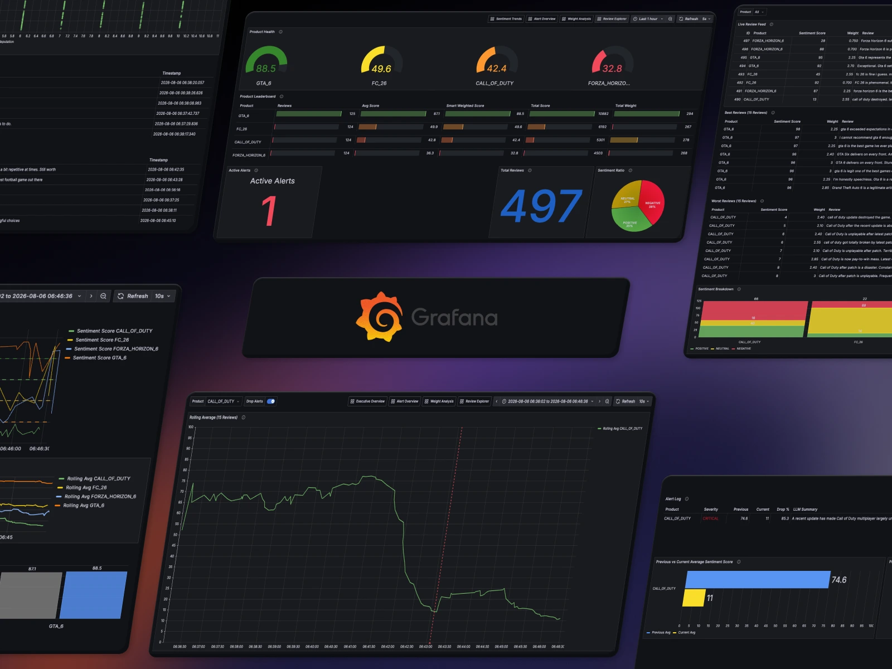

<br>

</div>

<br>

> [!NOTE]
> This repository is the improved version of my internship project at **Data Reply Munich, which I did at 14 as their youngest intern ever.**
> On my first day my tutor gave me [an article about Flink](https://flink.apache.org/2025/12/04/apache-flink-2.2.0-advancing-real-time-data--ai-and-empowering-stream-processing-for-the-ai-era/) and left me to it.
> I had never worked with Flink before and was new to data engineering in general.

<br>

## How I Got Here
I rebuilt this project five times. Every version fixed and improved something the one before fell short on and each one taught me more than the last about data engineering. So instead of only showing you the finished project,
I'll walk you through how it got there in detail.

<br>

### Version 1
A predefined set of product reviews streamed through Kafka at varying intervals, analysed by a locally running llama3.2 that worked out
which product a review was talking about and gave it a sentiment score.
<br><br>
The results were simply printed to the console. As far as I remember Version 1 only took me two days.
So I showed it to my tutor and then thought about what I could do next, so I came up with the next version.

---

### Version 2
First I split the producer and the consumer into two separate Maven projects. Then I dropped the fixed set of reviews and generated those with llama3.2 as well.
<br><br>
The rest stayed pretty much the same, except that the product and sentiment score were now saved to a Postgres database. The newest feature was a five minute window
that picked the best product by total sentiment score. This also didn't take very long.

---

### Version 3
The biggest problem with Version 2 was that my MacBook kept overheating and generating all the reviews took quite a while. On top of that, the model would not stick to the JSON format I told it to return,
so I kept running into parsing errors resulting in the program suddenly crashing.
<br><br>
So instead of running llama3.2 locally, I switched to Claude Haiku 4.5 using AWS Bedrock. That was also my first time using AWS at all. AWS Bedrock let me set a JSON response schema the model has no way of breaking,
which solved most of the issues. But I still wasn't happy with the project and had a lot of time left.

---

### Version 4
This is where the project stepped up a level. The code got a lot cleaner overall and the first real change was assigning each product a sentiment profile:
<br><br>
**POSITIVE_HEAVY, POSITIVE, NEUTRAL or NEGATIVE**
<br><br>
A profile decided how many good, neutral and bad reviews that product would get.
I also split the producer into two stages. Stage 1 asked the model for 100 reviews and handed it the sentiment profiles with their products, telling it that the POSITIVE_HEAVY product should for instance get 90% good reviews.
Once stage 1 had finished generating, the reviews started going out over Kafka at random intervals.
<br><br>
Stage 2 was then initialized and generated another 100 reviews asynchronously, except this time the product that had been POSITIVE
was switched to the new DROP profile. That was how I simulated a product collapsing, suddenly it was almost all bad reviews.
<br><br>
On top of that I improved the product ranking by adding weights the LLM assigned itself, like whether the purchase was verified or not and how many helpful votes a review had. That made the product ranking pipeline much better.

---

### Version 5
I still wasn't satisfied with what I had. Version 4 had plenty of problems, the LLM wouldn't listen to me and distributed the reviews horribly because it is not good with percentages and the weights were total chaos
and randomly distributed.
<br><br>
Version 5 is where I fixed all of that. **Everything from here on describes this version** and I'll go through each of those problems and how I solved them further down.

<br>

## The Scenario

Imagine you're the biggest video game publisher in the world. You have four games out:
<br><br>
**GTA 6, Call of Duty, Forza Horizon 6 and FC 26**
<br><br>
and reviews from your customers come in all the time. Then you ship a massive update to one of them and a game that was doing perfectly fine suddenly starts getting catastrophic reviews.

That's what this project simulates and then tries to catch in real time. The pipeline is not told which game is going to drop or when, it has to work that out from the reviews alone. The moment it does, it fires an alert with an LLM written
summary of what customers are actually complaining about and marks the exact spot it first detected a drop with a line in the Grafana dashboards.
<br><br>
Every time you start it, the four games are dealt one of four sentiment profiles at random:

| Profile | Positive | Neutral | Negative |                                 |
|:---|---:|---:|---:|:--------------------------------|
| `POSITIVE_HEAVY` | 90% | 5% | 5% | your best rated game            |
| `POSITIVE` | 65% | 25% | 10% | **this one gets dropped later** |
| `NEUTRAL` | 15% | 70% | 15% | neutral rated game              |
| `NEGATIVE` | 10% | 15% | 75% | nobody likes this one           |
| ↳ `DROP` | 5% | 5% | 90% | what `POSITIVE` becomes later   |

<br>

## Quick Start

```bash
git clone https://github.com/JamieCalaku/Flink-Review-Analytics-Pipeline.git
cd Flink-Review-Analytics-Pipeline
cp .env.example .env    # replace with your AWS credentials
docker compose up --build
```

> [!IMPORTANT]
> You will need to have Docker installed and an AWS account with **Bedrock model access enabled for Claude Haiku 4.5**. An account with valid credentials but no model access will fail on the first LLM call.

<br>

| Where | What |
|---|---|
| **[localhost:3000](http://localhost:3000)** | Grafana Dashboards|
| **[localhost:8081](http://localhost:8081)** | Flink Web UI, not really interesting |

<br>

> [!TIP]
> The way I'd recommend running it:
> <br>
> open the producer's console in Docker so you can see the reviews being generated and published and keep Grafana open on the **Executive Overview** dashboard.
> That way you catch the drop the moment the pipeline does.

<br>

### Running it again
Each time you run it, it will completly reset the database and start over.

<br>

## How It Works

In Stage 1 the producer prompts Claude for 250 reviews and then publishes them to Kafka one at a time, with 0.5 to 2 seconds of random delay between them, to make the data flow look a bit more realistic.

After that, Stage 2 prompts Claude for another 250 reviews. This time the product that normally had the POSITIVE profile gets the DROP profile. That way we simulate a realistic product sentiment drop.

The consumer is a single Flink job that takes that one stream and splits it into four pipelines:

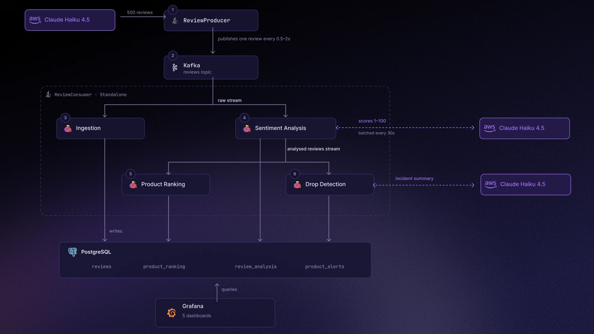

| # | Pipeline | What it does |
|---|:---|:---|
| **1** | [Ingestion](ReviewConsumer/src/main/java/com/jamiecalaku/pipeline/ReviewIngestionPipeline.java) | Writes the raw reviews into Postgres through a batched JDBC sink. |
| **2** | [Sentiment Analysis](ReviewConsumer/src/main/java/com/jamiecalaku/pipeline/ReviewSentimentAnalysisPipeline.java) | Collects reviews in a 30 second tumbling window and scores the whole batch in **one** LLM call.<br>Only `{id, body}` goes into the prompt to save tokens. |
| **3** | [Product Ranking](ReviewConsumer/src/main/java/com/jamiecalaku/pipeline/ProductRankingPipeline.java) | Keeps running totals per product in Flink keyed state and emits a plain average and a weighted score for every review. |
| **4** | [Drop Detection](ReviewConsumer/src/main/java/com/jamiecalaku/pipeline/ProductDropDetectionPipeline.java) | Detects product drops. More on that below. |

Only pipeline 2 sends anything to the model for scoring. Pipelines 3 and 4 just read the analysed reviews stream that pipeline 2 emits.

<br>

### Trust Weighted Scoring

Not every review should be weighted the same:

```
weight = verifiedPurchaseMultiplier × (1.0 + reviewerReputation × 0.1)
```

| Signal | Effect |
|:---|:---|
| Verified purchase | `× 1.5` |
| Unverified purchase | `× 0.5` |
| Reputation `0–10` | `+ 0.1 ×` per point |

<summary><b>Why reputation and not helpful votes?</b></summary>

Version 4 was weighted by helpful votes, which was a bit dumb of me. Votes need days to add up, a review posted five minutes ago has zero votes no matter how many people would agree with it. Reputation is already there.

Reviews that match a product's dominant sentiment get higher reputation and are verified more often, which is what gives them more weight.

<br>

### Drop Detection

This runs per product in keyed Flink state and uses the same `Σ(score × weight) / Σ(weight)` math as the ranking.

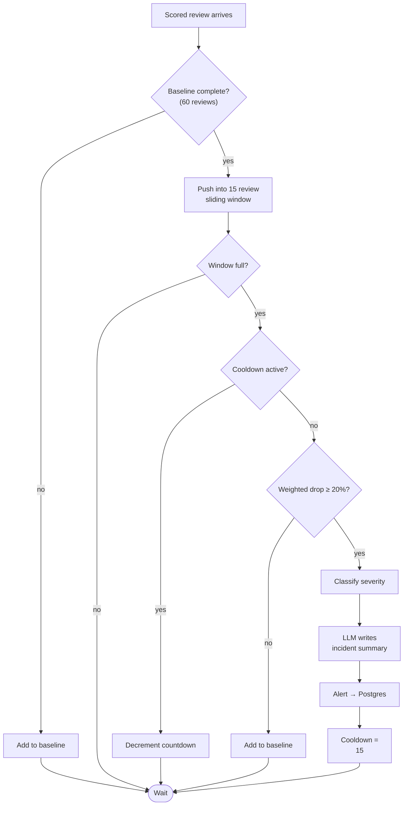

Four things I really like about it:

- The baseline drifts. If a score doesn't set off an alert it gets added back into the baseline, so normal keeps moving with the product instead of being stuck forever on whatever the first 60 reviews happened to be.
- Summaries build on each other. Every alert gets the previous summary handed back to it in the prompt, so a long incident ends up as one summary that keeps growing instead of losing everything that came before.
- There's a timer as a backup. It rearms on every review and if no new review comes in it fires one last check. Without it a product could sit in the pipeline forever, waiting for a window that never fills up.
- The severity climbs. An alert is an upsert on the product and not a new row, so while a drop keeps getting worse the same alert just gets updated. It can come in as LOW or MEDIUM, turning into HIGH and ending up as CRITICAL depending on the run.
  Because `first_detected` is never touched, the red line in Grafana stays on the moment it was first caught.

<br>

## See It Yourself

Everything below is from one single run:

<br>

### It starts out completely normal

A couple of minutes in, the Executive Overview looks like nothing is wrong. Every gauge is sitting roughly where its profile put it. `GTA_6` drew `POSITIVE_HEAVY` and sits at 87.3, `CALL_OF_DUTY` drew `POSITIVE` at 74.6 and the two weaker
games are down at 49.7 and 32.8.

The leaderboard shows the plain average and the weighted score next to each other, plus how much total weight each game has picked up so far. **Active Alerts is 0** and the sentiment split is still 42% positive.

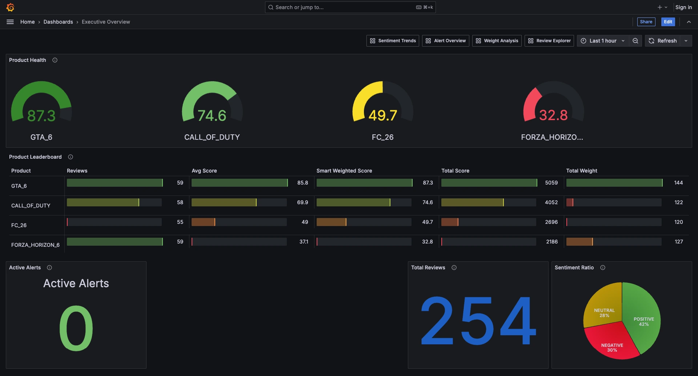

<br><br>

### Then stage 2 begins

The rolling average (15 reviews) stays between 65 and 75 through the whole first stage, then drops off a cliff at 06:41 and hits about 14 within two minutes.

The red dashed line is an annotation the pipeline writes itself. It sits on `first_detected`, so it marks the moment the detection crossed its threshold, not the moment the curve started falling. The gap between the two is the
sliding window filling up and I want that gap there. Firing any earlier would just mean many false alarms. One reason for that is that the LLM doesn't always produce the reviews reliably.

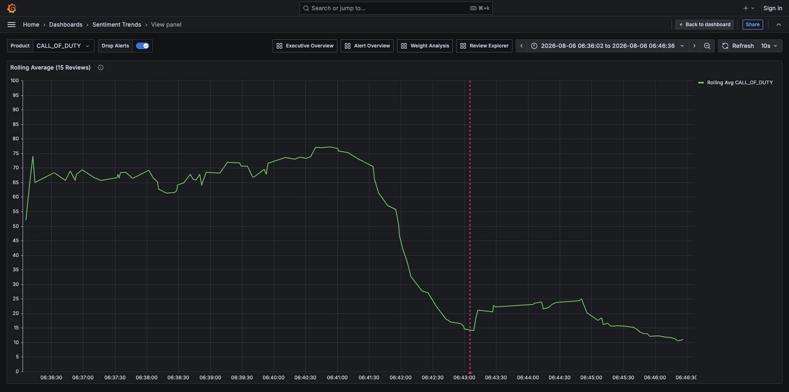

<br><br>

### The same dashboard at the end of the run

`CALL_OF_DUTY` went from 74.6 down to 42.4 and fell from second place to third, while the other three barely moved. The sentiment split flipped too, negative is now the biggest slice at 38%.

**Active Alerts is 1.**

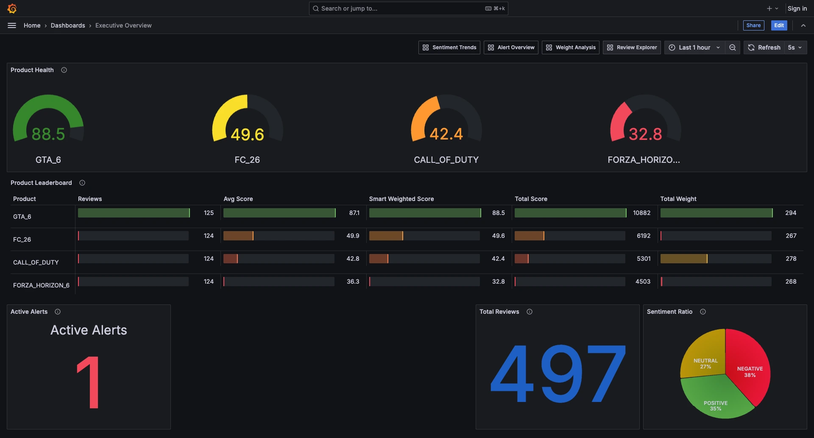

<br><br>

### This is what the alert says

The log row carries everything the detection worked with. Severity `CRITICAL`, the baseline it compared against 74.6, the current window average 11 and the drop 85.3%.

The `LLM Summary` column is the part I really like. The model read the 15 review bodies from the window and wrote that line, so instead of a number that went down you get told what customers argue about.

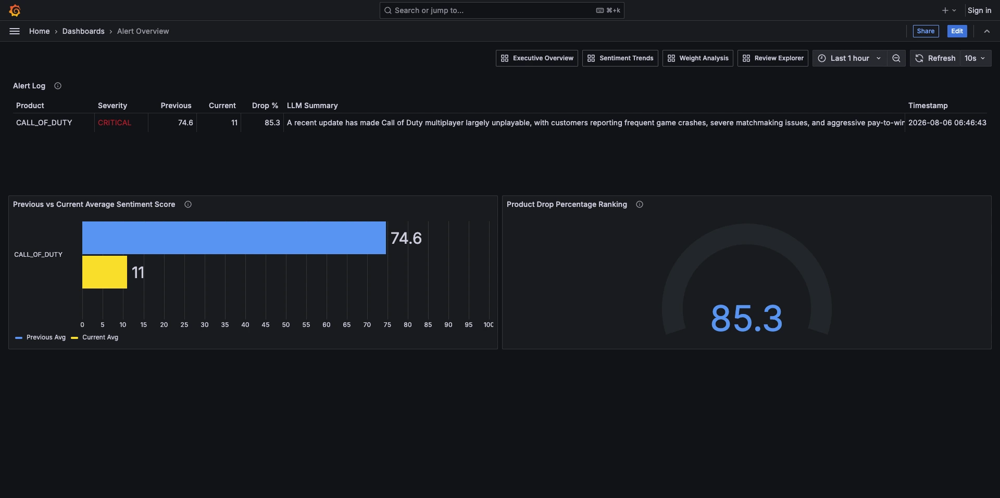

<br><br>

### More data analysis

So far you've seen two dashboards and one panel. Here are the ones left:

**Sentiment Trends** has four panels. The top one plots every single review as a point, which looks like chaos, but that's just what raw reviews are. The two panels under it are the same numbers averaged out so you can actually read them.
Green is the dropped game, and at 06:41 it splits away from the other three.

The bar chart at the bottom is also pretty interesting. Grey is the plain average, blue is the weighted one. `GTA_6` goes from 87.1 up to 88.5 once you weight it,
so trusted people like it a bit more than everyone else does. `FORZA_HORIZON_6`  also goes the other way, 36.3 down to 32.8.

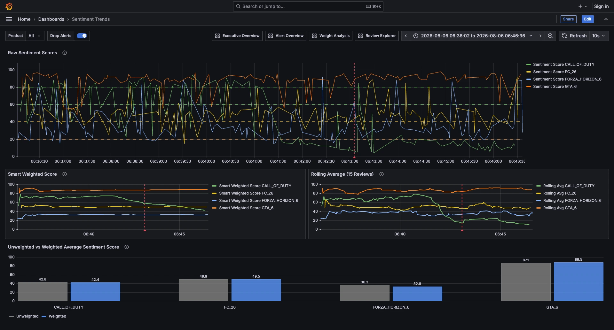

<br><br>

Filter it down to the dropped game and it's the same dashboard, just easier to read. In the raw panel you can watch the scores fall out of the 80s.

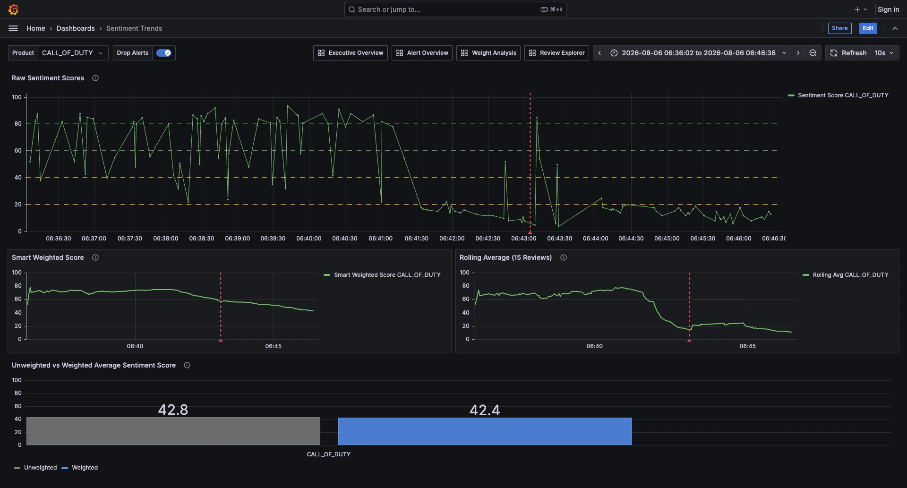

<br><br>

**Weight Analysis** puts reviewer reputation on the x axis and sentiment score on the y axis, one dot per review. They line up in columns because reputation is a whole number from 0 to 10.
Under it are the 15 heaviest and 15 lightest reviews.

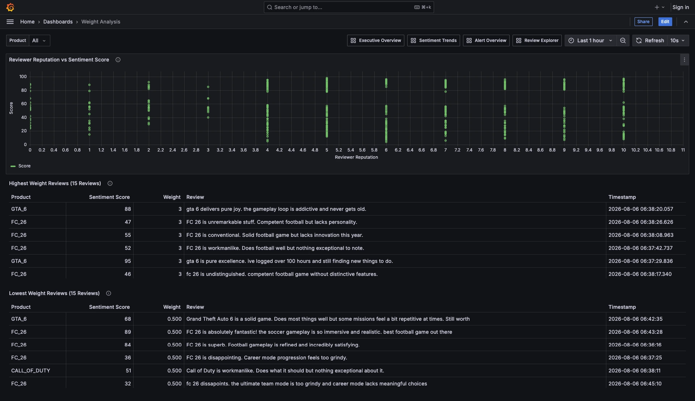

<br><br>

**Review Explorer** is what I mostly used for checking the model. If a score looked wrong I could read the actual review here and decide for myself.

The bottom half is the clearest proof I have that the whole thing works. All 15 of the worst reviews in the run belong to the dropped game, scored between 4 and 8.

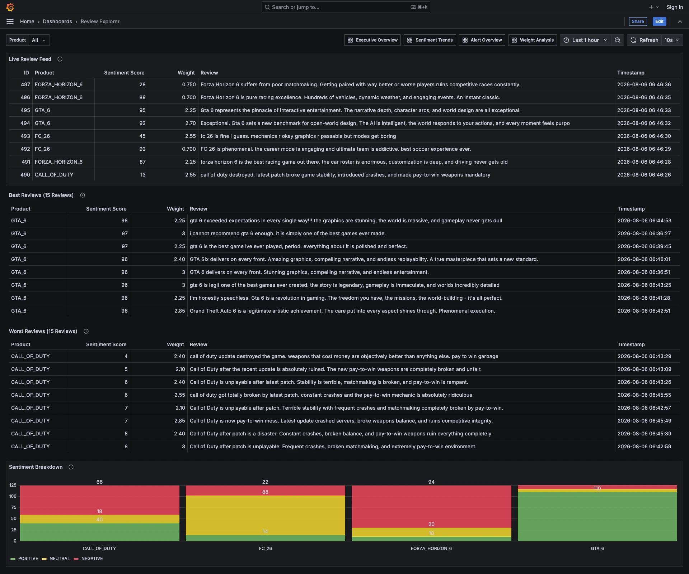

<br><br>

<sub>All five dashboards get provisioned from JSON when the container starts, so there is nothing to set up by hand. Three of them share the product filter and every one links to the others through the bar at the top.</sub>

<br>

## Configuration

Everything is an environment variable in [`docker-compose.yml`](docker-compose.yml).

<details>
<summary><b>Producer</b></summary>

| Variable | Default | What it does |
|:---|:---:|:---|
| `PRODUCER_BASELINE_REVIEW_COUNT` | `250` | reviews in stage 1 |
| `PRODUCER_DROP_REVIEW_COUNT` | `250` | reviews in stage 2 |
| `PRODUCER_WEIGHT_POSITIVE_HEAVY` | `90,5,5` | positive / neutral / negative split % |
| `PRODUCER_WEIGHT_POSITIVE` | `65,25,10` | the profile that gets dropped later |
| `PRODUCER_WEIGHT_NEUTRAL` | `15,70,15` | |
| `PRODUCER_WEIGHT_NEGATIVE` | `10,15,75` | |
| `PRODUCER_WEIGHT_DROP` | `5,5,90` | what `POSITIVE` turns into in stage 2 |
| `PRODUCER_MAJORITY_REPUTATION_MIN` / `_MAX` | `4` / `10` | reputation for majority sentiment reviews, the rest get `0–5` |

</details>

<details>
<summary><b>Consumer</b></summary>

| Variable | Default | What it does |
|:---|:---:|:---|
| `CONSUMER_ANALYSIS_TIME_WINDOW` | `30` | seconds per LLM batch window |
| `CONSUMER_DROP_DETECTION_BASELINE_SIZE` | `60` | reviews that define what normal looks like |
| `CONSUMER_DROP_DETECTION_WINDOW_SIZE` | `15` | sliding window size |
| `CONSUMER_DROP_DETECTION_THRESHOLD` | `20` | minimum weighted drop % before it alerts |
| `CONSUMER_DROP_DETECTION_SEVERITY_CRITICAL` | `50` | ≥ 50% drop → `CRITICAL` |
| `CONSUMER_DROP_DETECTION_SEVERITY_HIGH` | `35` | ≥ 35% → `HIGH` |
| `CONSUMER_DROP_DETECTION_SEVERITY_MEDIUM` | `25` | ≥ 25% → `MEDIUM`, anything below is `LOW` |
| `CONSUMER_FLINK_UI_PORT` | `8081` | Flink Web UI |

</details>

<br>

## Problems I faced

<details open>
<summary><b>The LLM ignored my counts</b></summary>

I asked for exactly 250 reviews with a fixed distribution per product and got **215**. The next run gave me **212**.

My first guess was that the token limit was cutting the response off. That was wrong for two reasons: the missing reviews were spread unevenly across the products instead of just missing at the end and the JSON always parsed fine. Raising `max_tokens` didn't change anything either.

The real reason was that my prompt was asking the model to keep **twelve counters** in its head at the same time, 4 products times 3 sentiments, each with its own target. It can't do that while also writing 250 different review texts. After a couple dozen it stops counting and starts guessing.

So instead of asking it to count I gave it something it can just look at.

**1 · Sequential ids.** Every review has to carry an `id` from 1 to 500. Now the model can read the counter off its own output instead of remembering it. The totals were correct immediately.

**2 · Id ranges instead of percentages:**

```text
- FORZA_HORIZON_6 POSITIVE:  ids 1-43
- FORZA_HORIZON_6 NEUTRAL:   ids 44-56
- FORZA_HORIZON_6 NEGATIVE:  ids 57-62
```

When it writes `"id": 56` it can see that the next one has to be NEGATIVE.

The producer then throws those ids out, shuffles the reviews and gives them new ids afterwards.

</details>

<br>

<details open>
<summary><b>LLM distributed the weights horribly</b></summary>

In Version 4 the model decided by itself whether a review was verified and how many helpful votes it had. There was no pattern in it, a five star rave could come back unverified and a one line insult verified. The weights were just noise.

Now the producer sets it in Java after the reviews come back, based on whether a review agrees with the product's dominant sentiment:

| | Reputation | Verified |
|:---|:---:|:---:|
| Goes against it | `0–5` | 65% |
| Agrees with the majority | `4–10` | 95% |

The ranges overlap on purpose so it stays a tendency, not a rule. And it's what makes the drop detection work, because once a game collapses the complaints *become* the majority and pull the weighted average down much harder than noise could.

</details>

<br><br>

<details>
<summary><b>False alarms</b>, three alerts and only one of them correct</summary>

Early runs gave me three alerts. One was real, the other two were small dips on products.

The reason was that I didn't use the smart weighted score but the average score. Also my threshold wasn't set up well, I was pushing the limits of an LLM so I couldn't completely trust it.

</details>

<br>

<details>
<summary><b>Scores stayed on round numbers</b></summary>

The sentiment scores looked off to me.

The model kept landing on 25, 50, 85 and 90.

What fixed it were explicit scoring rules in the prompt.

</details>

<br>

## What it taught me

<details open>
<summary><b>About LLMs</b></summary>

- **I really was pushing the limits of LLMs.** LLMs are horrible with counting and percentages, no matter how you phrase it. If something has to be exact, don't let the model do it.
- **They get lazy the longer the output gets.** The first 20 reviews were perfect and by review 200 it had stopped counting and started estimating.
- **You may have to work your way around some problems, but it's worth it.** Once you know what they're bad at and stop asking them to do it, they can be really powerful in your project.

</details>

<br>

<details open>
<summary><b>About data engineering</b></summary>

- **A lot of it isn't coding.** Figuring out how to solve a problem took more time than writing the actual code.

</details>

<br>

<details open>
<summary><b>About my first internship</b></summary>

- **"First make it work, then make it good."** I actually got to live by this quote. I'm normally a perfectionist, but this time I tried to follow it instead.
- **It doesn't have to be perfect.** Version 1 worked and wasn't anywhere near perfect. But with each version I came up with new solutions and made it better. There's still room for improvement,
  but the difference from the first version is massive.

</details>

<br>

## Tech Stack

| Layer | Technology |
|:---|:---|
| Stream processing | **Apache Flink 1.20** |
| Broker | **Apache Kafka** in KRaft mode |
| LLM | **Claude Haiku 4.5** on AWS Bedrock |
| Storage | **PostgreSQL 16** |
| Dashboards | **Grafana 11.4**, provisioned from files |
| Orchestration | **Docker Compose** |
| Build & runtime | **Java 17**, Maven, shaded JARs |

<br>

## Project Structure

```text
Flink-Review-Analytics-Pipeline/
├── docker-compose.yml               # all services and all configuration
├── Dockerfile.producer / .consumer
├── .env.example
│
├── ReviewProducer/                  # the generator
│   └── src/main/
│       ├── java/…/producer/         # generation, id ranges, Kafka publishing
│       ├── java/…/llm/              # Bedrock client
│       ├── java/…/utils/            # DatabaseInit and SentimentAssignment
│       └── resources/               # prompts and JSON schemas
│
├── ReviewConsumer/                  # the Flink job
│   └── src/main/
│       ├── java/…/consumer/         # Kafka source, invoking all pipelines
│       ├── java/…/llm/              # Bedrock client
│       ├── java/…/pipeline/         # the four pipelines
│       └── resources/               # prompts and JSON schemas
│
├── grafana/
│   ├── provisioning/                # datasource and dashboard providers
│   └── dashboards/                  # 5 dashboards as JSON
│
└── docs/images/                     # architecture diagram and screenshots
```

<details open>
<summary><b>Database tables</b></summary>

| Table | Write pattern | Holds |
|:---|:---|:---|
| `reviews` | upsert by id | the raw review text and its metadata |
| `review_analysis` | upsert by id | sentiment score and the calculated weight |
| `product_ranking` | append only | the running average and weighted score after every review |
| `product_alerts` | upsert by product | severity, both averages, drop %, LLM summary, `first_detected` |

All four get created at startup by [`DatabaseInit`](ReviewProducer/src/main/java/com/jamiecalaku/utils/DatabaseInit.java).

</details>

<br>

## Acknowledgements

Built during my internship at **[Data Reply](https://www.reply.com/data-reply/)** in Munich. This was genuinely a dream experience for me. Special thanks to my tutor for the amazing guidance
and to the whole team for welcoming me so warmly. I'm really glad I got this opportunity :)

<br>

## Conclusion
I started this knowing nothing about data engineering. I'm ending it thinking about how much I learned, not only about coding but about life too.
This project also got me interested in AI and I might consider training my own neural network from scratch someday.

<br>